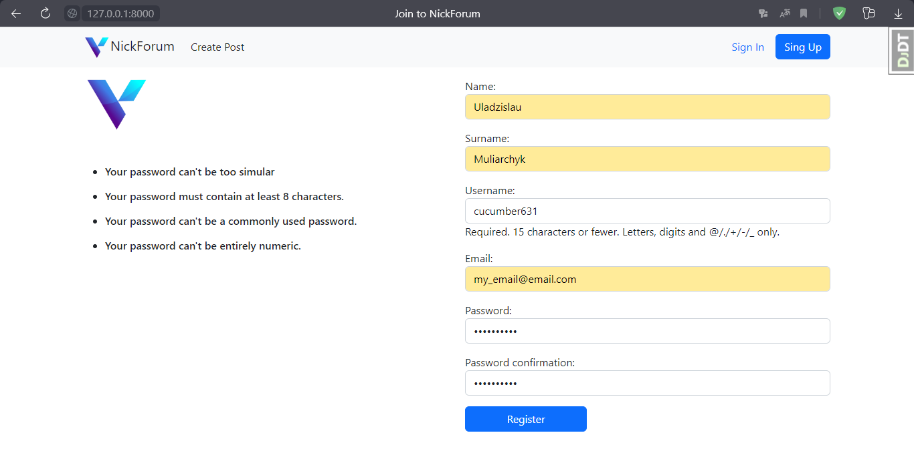
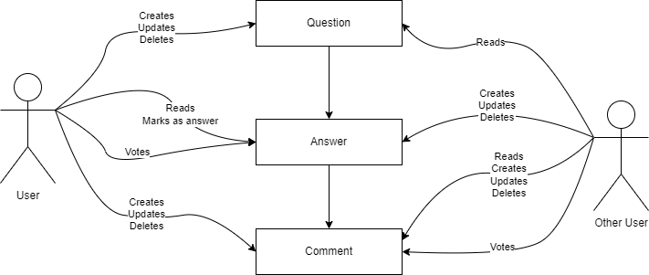
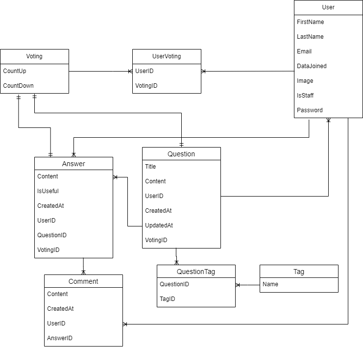

# Django Forum #

---
A small forum based on Django web framework. Forum for programmers. Designed for communication, finding answers to
various problems of the author of the post. Allows you to create questions, answers, view the profile of the
authors of questions, answers

# Built on #

---

* Django 4.1
* Python 3.10

# Screenshots #

---

Want to see the interface of the site? Check it out!

|  Registration |  |  |
|:---------------------------------------------------:|:--------------------------------------:|:--------------------------------------:|
|               |  |  |

# Business processes: #

---

# ERD: #

---

