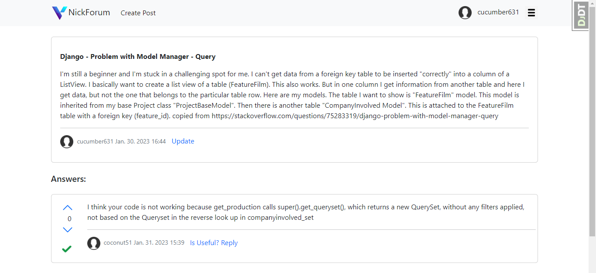
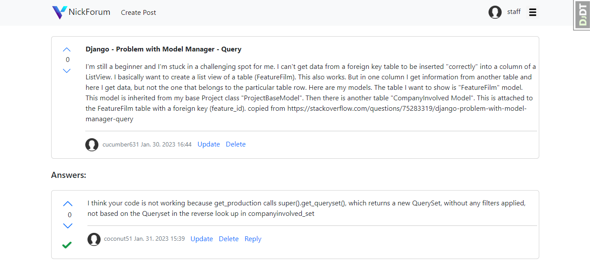

# Django Forum #

A small forum based on Django web framework. Forum for programmers. Designed for communication, finding answers to
various problems of the author of the post. Allows you to create questions, answers, view the profile of the
authors of questions, answers

# Built on #

* Django 4.1
* Python 3.10


# Getting started #

Clone the repository and enter into it.

``` 
$ git clone https://github.com/Mulyarchik/forum.git
$ cd forum
```

Set your settings in the ‘.env’ file, but defaults is enough just to try the service locally.

Run docker compose to build and run the service and it’s dependencies.

```
$ docker compose up -d --build
```

Optionally you can populate your database with some dummy data.

```
$ docker compose exec web python manage.py setup_test_data
```

Open in your browser:

```
http://localhost:8080/
```


# Business processes: #


# ERD: #


# Screenshots #

Want to see the interface of the site? Check it out!

|                            Registration                           |                  View Questions               |                             Create Post                          |
|:---------------------------------------------------------------------------------------------:|:---------------------------------------------------------------------------:|:-------------------------------------------------------------------------------------------:|
|                  View your Question               |                 Update Question              |    Leave a comment through another user |
|    Set comment status "was useful" via post author |   View Question through site Staff |            Voting a question through another user         |
|                            View profile                           |                 Change User photo               |                                                                                             |
